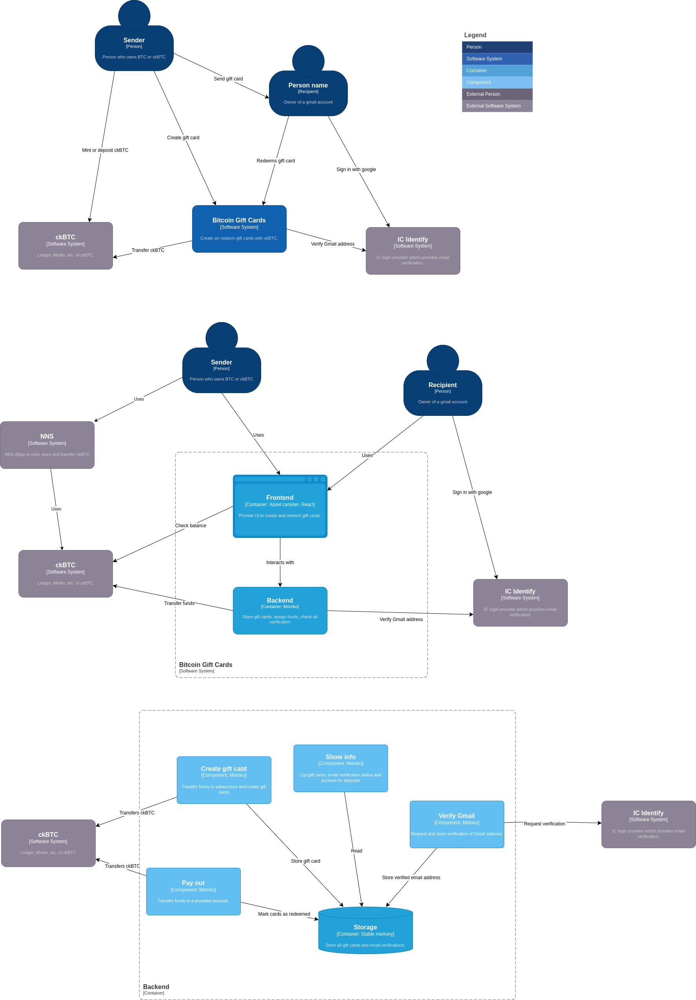

# Bitcoin Gift Cards

Create gift cards on [btc-gift-cards.com](https://btc-gift-cards.com)!


### 🎁 A Simple Way to Gift Bitcoin

Bitcoin Gift Cards is a project designed to make gifting Bitcoin easy and accessible, serving as an introduction to **ckBTC on the Internet Computer** and the broader ICP ecosystem. Whether it’s for Christmas, a birthday, or any special occasion, this project provides a seamless way to share Bitcoin with others.

### 🚀 Key Features
- **No Wallet Required**: Recipients can claim their gift cards using Google Sign-In, simplifying the process for newcomers.  
- **Powered by ckBTC**: Leverages the Internet Computer's ckBTC for secure and efficient transactions.  
- **Easy Onboarding**: Perfect for introducing new users to Bitcoin and the ICP ecosystem.  

⚠️ **Disclaimer**: This project is under active development. Please avoid loading large amounts onto the gift cards.

### 🌐 Links

- App: [BTC-Gift-Cards.com](https://btc-gift-cards.com)
- Frontend canister: [y4leg-vyaaa-aaaah-aq3ra-cai](https://y4leg-vyaaa-aaaah-aq3ra-cai.icp0.io/)
- Backend canister: [yvip2-dqaaa-aaaah-aq3qq-cai](https://a4gq6-oaaaa-aaaab-qaa4q-cai.raw.icp0.io/?id=yvip2-dqaaa-aaaah-aq3qq-cai)
- Presentation: [Encode Club - ICP Chain Fusion Hackathon BITCOIN EDITION: Finale](https://youtu.be/KhSwGzRhYc0)

## Features

- Show account balances
- Create gift cards
  - Assign an amount of ckBTC to be send with it
  - Specify recipient
  - Add custom message
  - Select gift card design
- Verify email ownership
  - Show instructions how to log in with an email that is not associated with a google account
- Show tips on what to do with the ckBTC
- Custom domain
- Preload images
- Auto verify email address
- Toast messages for success and error notifications
- Lock submit buttons if requests are pending
- Copy button to copy both html and text content of gift cards, to paste it to email or messanging apps

## Local setup

Init toolchain:

```bash
mops toolchain init
```

Create and deploy canisters:

```bash
# create all canisters
dfx canister create --all`
# deploy ledger canisters
(cd external/ && ./setup_ledger.sh)
# build and deploy remaining canisters
dfx deploy
```

For frontend development run the vite server:

```bash
npm start
```

Now you should be to access the application and sign in.

To get some funds for testing, call the transfer function on the ledger and specify the deposit address shown on the account page.

```bash
# when prompted, input principal and subaccount as show inside the app
dfx canister call ckbtc_ledger icrc1_transfer
```

Run the following command to execute all tests:

```bash
npm run test
```

## Architecture



## Roadmap

The following outlines the next features that are considered for implementation.
All of those are subject to change based on user feedback, or changes in development resources.

### March 2025 (completed)

During the Encode Culb Hackathon, BTC Gift Cards received a developer grant which also covered development of the following features.

- Implement new design
- Simplify account management
- Automated testing
- Documentation

### Further plans

- Automate sending emails (most likeley needed at some point, currently still manual)
- Add redeem by code (without email verification)
- Lightning integration to deposit/withdraw ckBTC

### Obsolete

- Shortcut to transfer gift card balance to main account
  - Not relevant as there is only one account for both gift cards and deposits.
- Progress indicator for ckBTC minter
  - Minting ckBTC has been removed. Users should use the NNS to convert between ckBTC and Bitcoin.
- Secure account by creating an II (To introduce new users to Internet Identity, which is widely used by apps on the IC)
  - Does not add much value for the app and makes it more confusing for new users. Users can learn about II by getting introduced to the NNS and other dApps on the IC.
